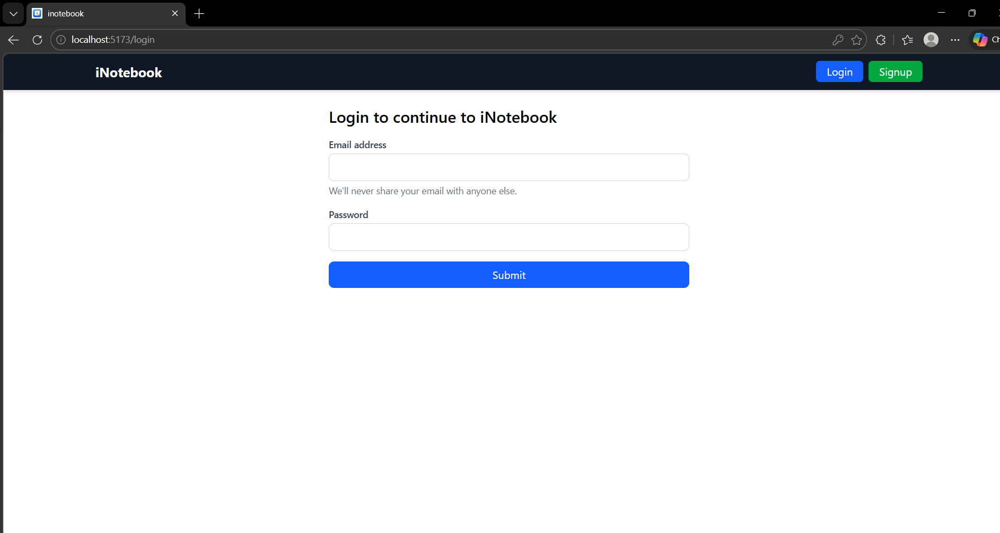
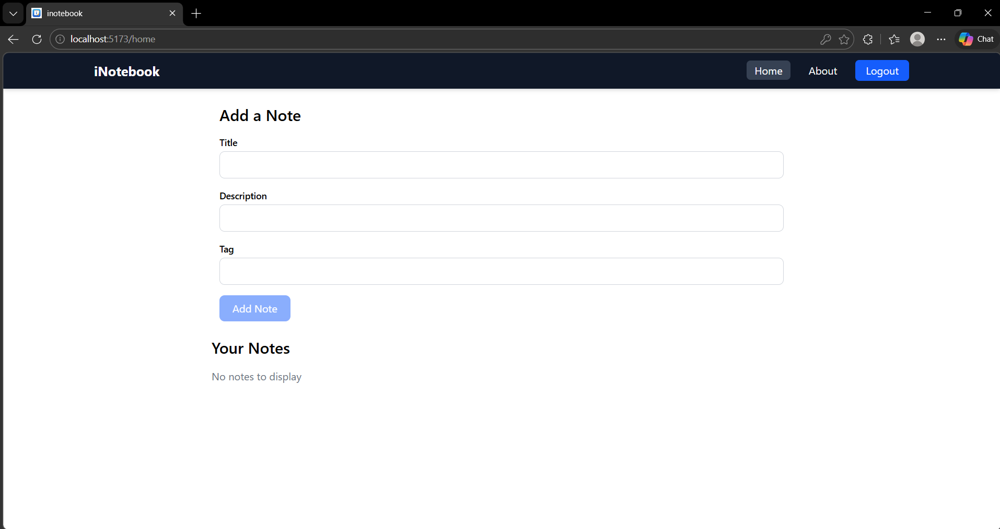
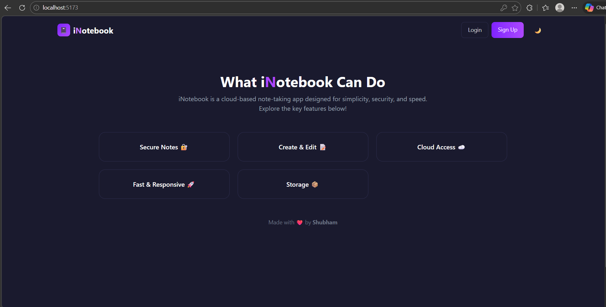
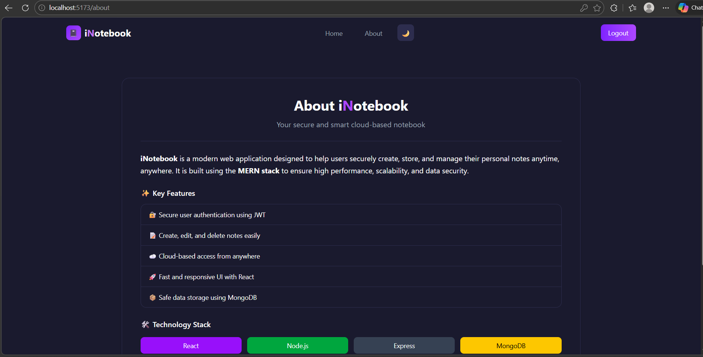

## iNotebook App Projects

iNotebook is a modern, cloud-based note-taking web application that allows users to securely create, edit, and manage their personal notes anytime, anywhere. It is designed for simplicity, speed, and security, using the MERN stack (MongoDB, Express.js, React.js, Node.js).

---

## 🔗 Live Demo
https://inotebook-shubham.vercel.app

## 📦 Backend API
https://inotebook-backend-q2gt.onrender.com


## Table of Contents

- [Features](#features)  
- [Demo](#demo)  
- [Technology Stack](#technology-stack)  
- [Installation](#installation)  
- [Usage](#usage)  
- [Screenshots](#screenshots)  
- [Author](#author)  

---

## Features

- 🔒 **Secure Notes**: User authentication and authorization using JWT.  
- 📝 **Create & Edit Notes**: Easily add, edit, and delete notes.  
- ☁️ **Cloud Access**: Access your notes from anywhere via the cloud.  
- 🚀 **Fast & Responsive UI**: Built with React for smooth user experience.  
- 📦 **Safe Storage**: Notes stored securely in MongoDB.  

---

## Demo

You can run the project locally to explore all features.

---

## Technology Stack

- **Frontend**: React.js  
- **Backend**: Node.js + Express.js  
- **Database**: MongoDB  
- **Authentication**: JWT  

---

## Installation

1. **Clone the repository**
   ```bash
   git clone <your-repo-url>
   cd inotebook


## Usage

- **Signup**: Create an account using your email and password.
- **Login**: Access your personal dashboard.
- **Add Notes**: Enter title, description, and tag to add a new note.
- **Edit/Delete** Notes: Update or remove existing notes easily.
- **About Page**: Learn about iNotebook and the technology stack.


## Screenshots

### `Page 1: Login`


### `Page 2: Notes`


### `Page 3: Service`


### `Page 4: About`



## Author

Made with ❤️ by Shubham